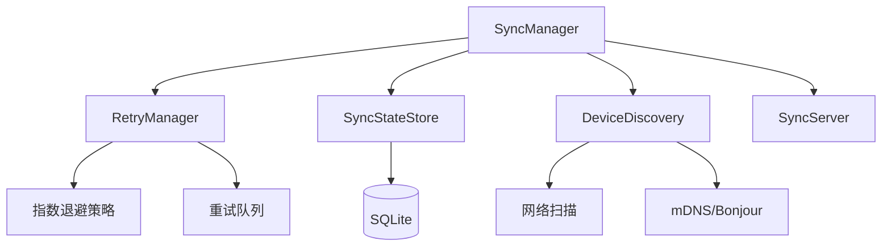
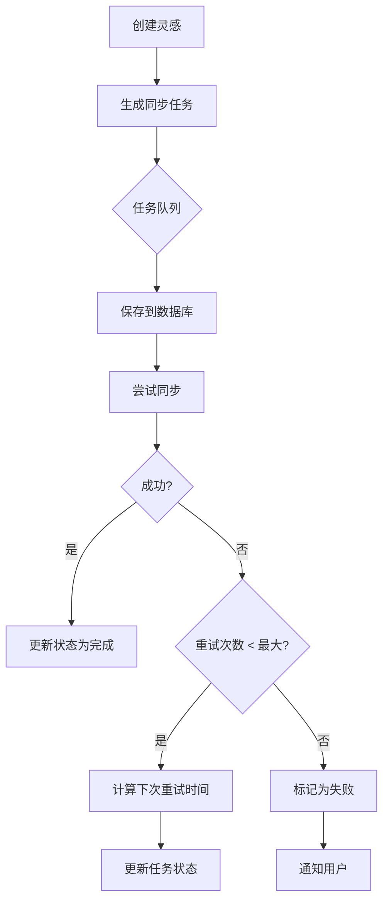
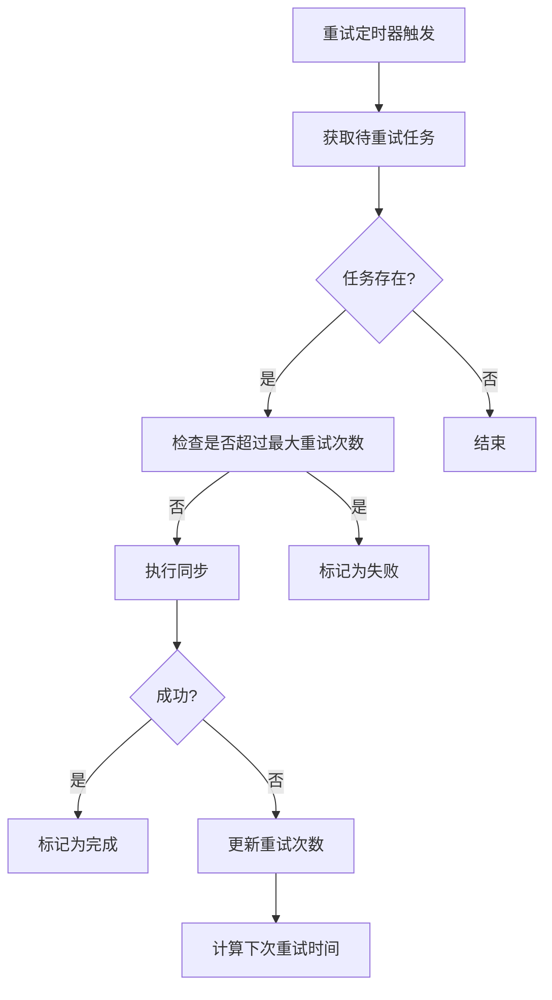

# 设计文档 - 同步系统改进

> 版本：v1.0  
> 日期：2026-06-15  
> 阶段：设计阶段

---

## 1. 需求分析

### 1.1 当前问题

| 问题编号 | 问题描述 | 严重程度 | 影响 |
|----------|----------|----------|------|
| SYNC-001 | 网络请求无重试机制，失败后直接丢弃数据 | 🟠 高 | 数据丢失 |
| SYNC-002 | 同步状态未持久化，重启后丢失 | 🟠 高 | 重复同步 |
| SYNC-003 | 错误处理不完善，缺乏错误恢复 | 🟡 中 | 用户体验 |
| SYNC-004 | 缺乏同步进度和状态反馈 | 🟡 中 | 用户体验 |
| SYNC-005 | 设备发现依赖手动添加，不够智能 | 🟢 低 | 易用性 |

### 1.2 功能需求

1. **重试机制** - 失败请求自动重试，支持指数退避
2. **状态持久化** - 同步状态保存到数据库，重启后恢复
3. **错误恢复** - 自动检测并恢复失败的同步任务
4. **进度反馈** - 提供实时同步进度和状态信息
5. **智能发现** - 改进设备发现机制

### 1.3 数据流要求

```
桌面宠物 → 灵感调酒师 → AI写作教练
   ↑            ↑            ↑
  单向        单向          单向
```

---

## 2. 技术方案

### 2.1 架构设计



### 2.2 核心组件

| 组件 | 职责 | 状态 |
|------|------|------|
| SyncManager | 同步协调器 | ✅ 现有 |
| RetryManager | 重试逻辑管理 | 🆕 新增 |
| SyncStateStore | 状态持久化 | 🆕 新增 |
| DeviceDiscovery | 设备发现 | ✅ 改进 |
| SyncServer | HTTP 服务 | ✅ 现有 |

### 2.3 数据模型

```typescript
// 同步任务状态
interface SyncTask {
  id: string;
  inspirationId: string;
  targetDeviceId: string;
  status: 'pending' | 'syncing' | 'completed' | 'failed';
  retryCount: number;
  maxRetries: number;
  nextRetryTime: string;
  createdAt: string;
  updatedAt: string;
  error?: string;
}

// 同步状态
interface SyncStatus {
  lastSyncTime: string;
  pendingTasks: number;
  failedTasks: number;
  syncingTasks: number;
  completedTasks: number;
}

// 设备信息增强
interface SyncDeviceEnhanced extends SyncDevice {
  healthStatus: 'online' | 'offline' | 'unhealthy';
  responseTime: number;
  lastSyncSuccess: string;
  syncFailureCount: number;
}
```

---

## 3. 详细设计

### 3.1 RetryManager 重试管理器

**核心功能**：
- 指数退避重试策略
- 最大重试次数限制
- 任务优先级管理
- 定时重试调度

**重试策略**：
| 重试次数 | 等待时间 | 计算公式 |
|----------|----------|----------|
| 1 | 30秒 | 30s |
| 2 | 1分钟 | 30s × 2¹ |
| 3 | 2分钟 | 30s × 2² |
| 4 | 4分钟 | 30s × 2³ |
| 5+ | 8分钟（上限） | min(30s × 2ⁿ, 8min) |

### 3.2 SyncStateStore 状态存储

**功能**：
- 持久化同步任务队列
- 保存同步状态历史
- 支持事务操作
- 提供状态查询接口

**数据库表设计**：
```sql
CREATE TABLE sync_tasks (
  id TEXT PRIMARY KEY,
  inspiration_id TEXT NOT NULL,
  target_device_id TEXT NOT NULL,
  status TEXT NOT NULL DEFAULT 'pending',
  retry_count INTEGER DEFAULT 0,
  max_retries INTEGER DEFAULT 5,
  next_retry_time TEXT,
  created_at TEXT DEFAULT CURRENT_TIMESTAMP,
  updated_at TEXT DEFAULT CURRENT_TIMESTAMP,
  error TEXT
);

CREATE TABLE sync_history (
  id INTEGER PRIMARY KEY AUTOINCREMENT,
  inspiration_id TEXT NOT NULL,
  source_device TEXT,
  target_device TEXT,
  status TEXT NOT NULL,
  timestamp TEXT DEFAULT CURRENT_TIMESTAMP,
  duration_ms INTEGER
);
```

### 3.3 DeviceDiscovery 改进

**增强功能**：
- 局域网扫描（端口扫描）
- mDNS/Bonjour 支持（如果环境允许）
- 设备健康状态检测
- 响应时间统计

**健康检查策略**：
```typescript
// 健康检查间隔
const HEALTH_CHECK_INTERVAL = 30000; // 30秒

// 超时配置
const REQUEST_TIMEOUT = 5000; // 5秒

// 健康状态判定
const UNHEALTHY_THRESHOLD = 3; // 连续失败3次标记为不健康
```

### 3.4 错误处理策略

| 错误类型 | 处理方式 | 重试 |
|----------|----------|------|
| 网络超时 | 立即重试（最多3次） | ✅ |
| 连接拒绝 | 延迟重试（指数退避） | ✅ |
| HTTP 5xx | 延迟重试（指数退避） | ✅ |
| HTTP 4xx | 记录错误，不再重试 | ❌ |
| 数据冲突 | 记录冲突，通知用户 | ❌ |

---

## 4. 接口设计

### 4.1 SyncManager API

```typescript
interface SyncManagerAPI {
  // 初始化
  init(config?: Partial<SyncConfig>, callbacks?: SyncEventCallbacks): Promise<void>;
  
  // 同步操作
  sendInspiration(inspiration: Inspiration, targetDeviceId?: string): Promise<void>;
  pushToWritingCoach(): Promise<void>;
  syncNow(): Promise<SyncResponse>;
  
  // 状态查询
  getSyncStatus(): SyncStatus;
  getPendingTasks(): SyncTask[];
  getSyncHistory(): SyncHistory[];
  
  // 任务管理
  retryFailedTask(taskId: string): Promise<void>;
  cancelTask(taskId: string): Promise<void>;
  clearCompletedTasks(): Promise<void>;
  
  // 设备管理
  discoverDevices(): Promise<SyncDevice[]>;
  addDevice(ip: string, port: number, type: string, name: string): SyncDevice;
  removeDevice(id: string): boolean;
  
  // 配置
  getConfig(): SyncConfig;
  updateConfig(config: Partial<SyncConfig>): void;
  
  // 生命周期
  shutdown(): Promise<void>;
}
```

### 4.2 HTTP API 接口

| 接口 | 方法 | 路径 | 描述 |
|------|------|------|------|
| 获取设备信息 | GET | /api/info | 返回设备基本信息 |
| 获取灵感列表 | GET | /api/inspirations | 获取本地灵感列表 |
| 接收灵感 | POST | /api/inspirations | 接收来自其他设备的灵感 |
| 同步状态 | GET | /api/sync/status | 获取同步状态 |
| 手动同步 | POST | /api/sync/now | 触发立即同步 |
| 设备发现 | GET | /api/devices | 获取已发现的设备 |

---

## 5. 流程设计

### 5.1 同步流程



### 5.2 重试流程



---

## 6. 测试计划

### 6.1 单元测试

| 测试用例 | 场景 | 预期结果 |
|----------|------|----------|
| TC-SYNC-001 | 重试管理器 - 指数退避 | 重试间隔按指数增长 |
| TC-SYNC-002 | 状态存储 - 任务持久化 | 重启后任务不丢失 |
| TC-SYNC-003 | 设备发现 - 健康检查 | 离线设备被正确标记 |
| TC-SYNC-004 | 错误处理 - 网络超时 | 自动重试3次后停止 |
| TC-SYNC-005 | 错误处理 - HTTP 4xx | 不再重试，记录错误 |

### 6.2 集成测试

| 测试用例 | 场景 | 预期结果 |
|----------|------|----------|
| IT-SYNC-001 | 完整同步流程 | 灵感成功同步到写作教练 |
| IT-SYNC-002 | 网络中断恢复 | 中断后自动重试 |
| IT-SYNC-003 | 设备离线处理 | 离线设备任务进入重试队列 |
| IT-SYNC-004 | 数据冲突处理 | 正确处理重复数据 |

### 6.3 边界测试

| 测试用例 | 场景 | 预期结果 |
|----------|------|----------|
| BT-SYNC-001 | 大量灵感同步 | 系统不崩溃，性能稳定 |
| BT-SYNC-002 | 频繁网络波动 | 自动重试，最终成功 |
| BT-SYNC-003 | 设备版本不兼容 | 正确处理版本差异 |

---

## 7. 验收标准

### 7.1 功能验收

| 编号 | 检查项 | 通过条件 |
|------|--------|----------|
| ACC-SYNC-001 | 重试机制 | 失败请求自动重试，指数退避 |
| ACC-SYNC-002 | 状态持久化 | 重启后同步任务不丢失 |
| ACC-SYNC-003 | 错误恢复 | 网络恢复后自动继续同步 |
| ACC-SYNC-004 | 进度反馈 | 提供实时同步进度 |
| ACC-SYNC-005 | 设备发现 | 自动扫描局域网设备 |
| ACC-SYNC-006 | 错误处理 | HTTP 4xx 不重试，5xx 重试 |

### 7.2 性能验收

| 编号 | 检查项 | 通过条件 |
|------|--------|----------|
| PERF-SYNC-001 | 同步延迟 | 单次同步 < 500ms |
| PERF-SYNC-002 | 批量同步 | 100个灵感 < 30s |
| PERF-SYNC-003 | 内存占用 | 同步期间 < 50MB |

---

## 8. 实施计划

### 8.1 时间安排

| 阶段 | 时间 | 任务 |
|------|------|------|
| 第一阶段 | 1天 | 实现 RetryManager |
| 第二阶段 | 1天 | 实现 SyncStateStore |
| 第三阶段 | 1天 | 改进 DeviceDiscovery |
| 第四阶段 | 1天 | 集成测试和调试 |
| 第五阶段 | 0.5天 | 文档更新 |

### 8.2 风险评估

| 风险 | 概率 | 影响 | 应对措施 |
|------|------|------|----------|
| SQLite 操作阻塞 UI | 中 | 高 | 使用异步操作 |
| 重试队列过大 | 低 | 中 | 限制队列大小 |
| 网络扫描耗时 | 低 | 低 | 后台异步扫描 |

---

## 9. 设计确认

请确认以下设计内容：

| 确认项 | 确认 |
|--------|------|
| 重试机制（指数退避） | ▢ 同意 / ▢ 修改 |
| 状态持久化（SQLite） | ▢ 同意 / ▢ 修改 |
| 错误处理策略 | ▢ 同意 / ▢ 修改 |
| 设备发现改进 | ▢ 同意 / ▢ 修改 |
| 测试计划 | ▢ 同意 / ▢ 修改 |

---

**设计文档版本：** v1.0  
**创建日期：** 2026-06-15  
**设计人：** AI 架构师

---

## 📋 下一步

请查看以上设计文档，确认是否符合你的需求：

1. **同意设计** - 进入修改阶段，开始实现代码
2. **需要修改** - 请指出需要修改的部分
