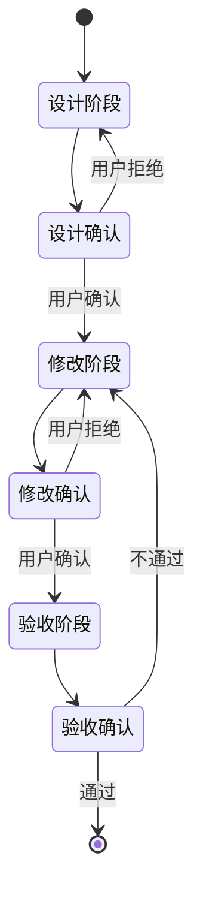
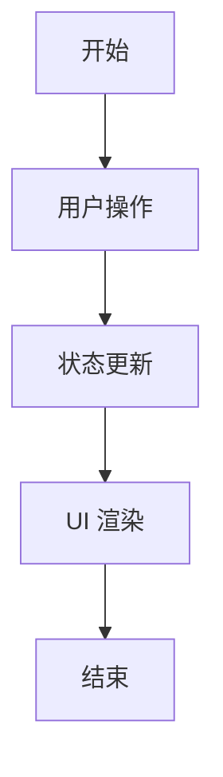

# 灵感调酒师 - 执行流程管理体系

> 版本：v1.0  
> 日期：2026-06-15  
> 状态：设计完成

---

## 一、流程管理框架

### 1.1 核心流程

```
设计阶段 → 修改阶段 → 验收阶段
   ↓            ↓            ↓
 确认          确认          完成/回退
```

### 1.2 流程职责

| 阶段 | 负责人 | 职责 | 输出 |
|------|--------|------|------|
| **设计** | 架构师 | 分析需求、设计方案、编写文档 | 设计文档、技术方案 |
| **修改** | 开发者 | 实现代码、单元测试、代码审查 | 代码变更、测试报告 |
| **验收** | 测试员 | 功能测试、集成测试、回归测试 | 验收报告、发布说明 |

### 1.3 流程状态机



---

## 二、文档库结构

### 2.1 文档库目录

```
docs/
├── index.md                    # 文档库总索引
├── standards/                  # 标准文档
│   ├── CODE_STANDARDS.md       # 代码规范
│   ├── DESIGN_STANDARDS.md     # 设计规范
│   └── CONTRIBUTING.md         # 贡献指南
├── plans/                      # 计划文档
│   ├── 2026-06-08-Phase1.md
│   ├── 2026-06-08-Phase2.md
│   └── 2026-06-08-Phase3.md
├── specs/                      # 详细设计规范
│   ├── glass-component.md      # 玻璃杯组件规范
│   ├── llm-service.md          # LLM服务规范
│   ├── scoring-system.md       # 评分系统规范
│   └── sync-protocol.md        # 同步协议规范
├── errors/                     # 错误历史
│   ├── index.md                # 错误索引
│   ├── ERR-001.md              # 错误详情
│   └── ERR-002.md
└── assets/                     # 资源文件
    └── prompt-generator.html   # 提示词生成器
```

### 2.2 文档索引格式

**docs/index.md** 示例：

```markdown
# 灵感调酒师 - 文档库索引

## 快速导航

### 📋 计划文档
- [Phase 1 - 基础功能](plans/2026-06-08-Phase1.md)
- [Phase 2 - 对话补全](plans/2026-06-08-Phase2.md)
- [Phase 3 - 灵感碰撞](plans/2026-06-08-Phase3.md)

### 📐 技术规范
- [玻璃杯组件规范](specs/glass-component.md)
- [LLM服务规范](specs/llm-service.md)
- [评分系统规范](specs/scoring-system.md)
- [同步协议规范](specs/sync-protocol.md)

### 📝 标准文档
- [代码规范](standards/CODE_STANDARDS.md)
- [设计规范](standards/DESIGN_STANDARDS.md)
- [贡献指南](standards/CONTRIBUTING.md)

### 🚨 错误历史
- [错误索引](errors/index.md)
```

---

## 三、错误历史记录系统

### 3.1 错误记录格式

**ERR-XXX.md** 模板：

```markdown
# ERR-XXX: 错误标题

## 基本信息

| 字段 | 内容 |
|------|------|
| 错误编号 | ERR-XXX |
| 发现日期 | YYYY-MM-DD |
| 发现人 | 姓名/角色 |
| 严重程度 | 🔴 致命 / 🟠 高 / 🟡 中 / 🟢 低 |
| 状态 | ⏳ 待处理 / 🔧 处理中 / ✅ 已解决 / 🚫 已关闭 |

## 错误描述

详细描述错误现象、复现步骤、预期行为、实际行为。

### 复现步骤
1. 步骤一
2. 步骤二
3. 步骤三

## 解决方案

详细描述修复方案、代码变更、测试验证。

### 代码变更
- 文件路径：`src/path/to/file.ts`
- 修改内容：...

### 测试验证
- 测试用例：...
- 测试结果：✅ 通过

## 预防措施

描述如何防止类似错误再次发生。

## 关联错误

- [ERR-YYY](ERR-YYY.md) - 相关错误链接
```

### 3.2 错误索引格式

**errors/index.md** 示例：

```markdown
# 错误历史索引

## 统计概览

| 状态 | 数量 |
|------|------|
| 待处理 | 2 |
| 处理中 | 1 |
| 已解决 | 15 |
| 已关闭 | 3 |

## 错误列表

### 🔴 致命错误
- [ERR-001: SQLite 数据库连接失败](ERR-001.md) ✅

### 🟠 高优先级
- [ERR-002: LLM API 调用超时](ERR-002.md) 🔧
- [ERR-003: 杯子组件渲染异常](ERR-003.md) ⏳

### 🟡 中优先级
- [ERR-004: 同步协议解析失败](ERR-004.md) ✅

### 🟢 低优先级
- [ERR-005: UI 样式不一致](ERR-005.md) ✅
```

---

## 四、验收检查清单

### 4.1 功能验收清单

**通用验收标准**：

| 编号 | 检查项 | 通过条件 | 状态 |
|------|--------|----------|------|
| ACC-001 | 代码编译 | TypeScript 类型检查通过 | ✅/❌ |
| ACC-002 | 单元测试 | 所有单元测试通过 | ✅/❌ |
| ACC-003 | 功能测试 | 按测试用例执行通过 | ✅/❌ |
| ACC-004 | 代码审查 | 符合代码规范 | ✅/❌ |
| ACC-005 | 文档更新 | 相关文档已更新 | ✅/❌ |

**Phase 1 验收清单**：

| 编号 | 检查项 | 通过条件 |
|------|--------|----------|
| P1-001 | 吧台场景 | 显示杯子网格，支持点击查看详情 |
| P1-002 | 灵感捕获 | 支持输入标题、描述、选择杯子类型 |
| P1-003 | 灵感详情 | 显示灵感完整信息，支持删除操作 |
| P1-004 | 液体动画 | 根据完成度显示液体高度 |

**Phase 2 验收清单**：

| 编号 | 检查项 | 通过条件 |
|------|--------|----------|
| P2-001 | 对话界面 | 显示聊天记录，支持用户输入 |
| P2-002 | LLM 调用 | 正确调用 LLM API，返回有效响应 |
| P2-003 | 评分系统 | 正确计算四维评分 |
| P2-004 | 进度指示 | 显示 5 步完善进度 |

**Phase 3 验收清单**：

| 编号 | 检查项 | 通过条件 |
|------|--------|----------|
| P3-001 | 多选功能 | 支持选择 2-3 个灵感 |
| P3-002 | 碰撞动画 | 倒入→摇晃→倒出三阶段动画 |
| P3-003 | 配方生成 | AI 生成创意配方建议 |
| P3-004 | 配方卡片 | 展示评分、关键词、方向 |

### 4.2 验收报告格式

```markdown
# 验收报告

## 基本信息

| 字段 | 内容 |
|------|------|
| 项目名称 | 灵感调酒师 |
| 阶段 | Phase X |
| 版本 | vX.X |
| 验收日期 | YYYY-MM-DD |
| 验收人 | 姓名 |

## 验收结果

### ✅ 通过项
- ACC-001: 代码编译通过
- ACC-002: 单元测试通过

### ⚠️ 待改进项
- P2-003: 评分系统精度待优化

### ❌ 未通过项
- 无

## 验收结论

[ ] 🔴 未通过，需重新修改
[ ] 🟡 有条件通过，需修复待改进项
[X] 🟢 通过，可进入下一阶段

## 签名确认

验收人：___________  
日期：___________
```

---

## 五、执行流程模板

### 5.1 设计阶段模板

```markdown
# 设计文档 - [功能名称]

## 1. 需求分析

### 需求来源
- 用户需求：...
- 业务目标：...
- 优先级：高/中/低

### 功能概述
简要描述功能目标和预期效果。

## 2. 技术方案

### 架构设计
- 模块划分
- 数据流向
- 接口设计

### 技术选型
| 组件 | 技术 | 版本 |
|------|------|------|
| 前端框架 | React Native | 0.72.x |
| 状态管理 | Zustand | 4.x |
| 数据库 | SQLite | - |

### 核心流程图



## 3. 详细设计

### 数据模型
```typescript
interface Inspiration {
  id: string;
  name: string;
  type: GlassType;
  completion: number;
}
```

### 接口设计

| 接口 | 方法 | 参数 | 返回值 |
|------|------|------|--------|
| /api/inspirations | GET | - | Inspiration[] |
| /api/inspirations | POST | Inspiration | Inspiration |

## 4. 测试计划

### 测试用例

| 用例 | 场景 | 预期结果 |
|------|------|----------|
| TC-001 | 创建灵感 | 返回新灵感对象 |
| TC-002 | 获取列表 | 返回灵感列表 |

## 5. 验收标准

| 检查项 | 通过条件 |
|--------|----------|
| 功能完整性 | 所有测试用例通过 |
| 代码质量 | 符合代码规范 |
| 文档完整性 | 相关文档已更新 |
```

### 5.2 修改阶段模板

```markdown
# 修改记录 - [功能名称]

## 1. 修改内容

### 文件变更

| 文件路径 | 修改类型 | 说明 |
|----------|----------|------|
| src/screen/xxx.tsx | 修改 | 添加新功能 |
| src/store/xxx.ts | 修改 | 更新状态管理 |

### 代码变更

```typescript
// 修改前
function oldFunction() {
  // 旧代码
}

// 修改后
function newFunction() {
  // 新代码
}
```

## 2. 测试验证

### 单元测试
- 测试文件：`__tests__/xxx.test.ts`
- 测试结果：✅ 通过

### 功能测试
- 测试场景：...
- 测试结果：✅ 通过

## 3. 代码审查

| 审查项 | 结果 | 备注 |
|--------|------|------|
| 代码规范 | ✅ | 符合 CODE_STANDARDS.md |
| 类型安全 | ✅ | TypeScript 检查通过 |
| 性能优化 | ✅ | 无明显性能问题 |

## 4. 影响评估

| 模块 | 影响程度 | 说明 |
|------|----------|------|
| 数据库 | 低 | 无需迁移 |
| UI | 中 | 影响相关界面 |
| API | 低 | 无接口变更 |
```

### 5.3 验收阶段模板

```markdown
# 验收报告 - [功能名称]

## 1. 验收依据

- 设计文档：[链接]
- 修改记录：[链接]
- 测试用例：[链接]

## 2. 验收内容

### 功能测试

| 编号 | 测试项 | 结果 | 备注 |
|------|--------|------|------|
| FT-001 | 主功能 | ✅ | 通过 |
| FT-002 | 边界情况 | ✅ | 通过 |
| FT-003 | 错误处理 | ✅ | 通过 |

### 集成测试

| 编号 | 测试项 | 结果 | 备注 |
|------|--------|------|------|
| IT-001 | 与其他模块集成 | ✅ | 通过 |
| IT-002 | 数据同步 | ✅ | 通过 |

### 回归测试

| 编号 | 测试项 | 结果 | 备注 |
|------|--------|------|------|
| RT-001 | 现有功能不受影响 | ✅ | 通过 |

## 3. 问题记录

### 已修复问题
| 编号 | 描述 | 解决方案 |
|------|------|----------|
| P-001 | ... | ... |

### 待优化项
| 编号 | 描述 | 优先级 |
|------|------|--------|
| O-001 | ... | 中 |

## 4. 验收结论

[ ] 未通过
[ ] 有条件通过
[X] 通过

## 5. 签名确认

验收人：___________  
日期：___________
```

---

## 六、使用指南

### 6.1 启动新功能开发

```
1. 创建设计文档 → 提交审核
2. 用户确认后 → 开始修改
3. 完成修改 → 提交验收
4. 验收通过 → 进入下一阶段
```

### 6.2 处理错误

```
1. 发现错误 → 创建错误记录 (ERR-XXX.md)
2. 分析原因 → 制定解决方案
3. 实施修复 → 更新错误记录状态
4. 验证修复 → 关闭错误记录
```

### 6.3 文档管理

```
1. 新增功能 → 更新文档索引
2. 修改代码 → 更新相关规范文档
3. 修复错误 → 添加错误记录
4. 版本发布 → 更新版本说明
```

---

**版本：** v1.0  
**创建日期：** 2026-06-15  
**适用项目：** 灵感调酒师

---

## 📋 下一步操作

你想从哪个流程开始？

1. **设计阶段** - 分析需求、编写设计文档
2. **修改阶段** - 实现代码、编写测试
3. **验收阶段** - 功能测试、集成测试

或者你想先完善某个特定模块？

1. **玻璃杯组件** - 优化渲染和动画
2. **LLM 服务** - 完善 API 调用和错误处理
3. **同步系统** - 增强局域网同步稳定性
4. **素材系统** - 集成 AI 生图功能
